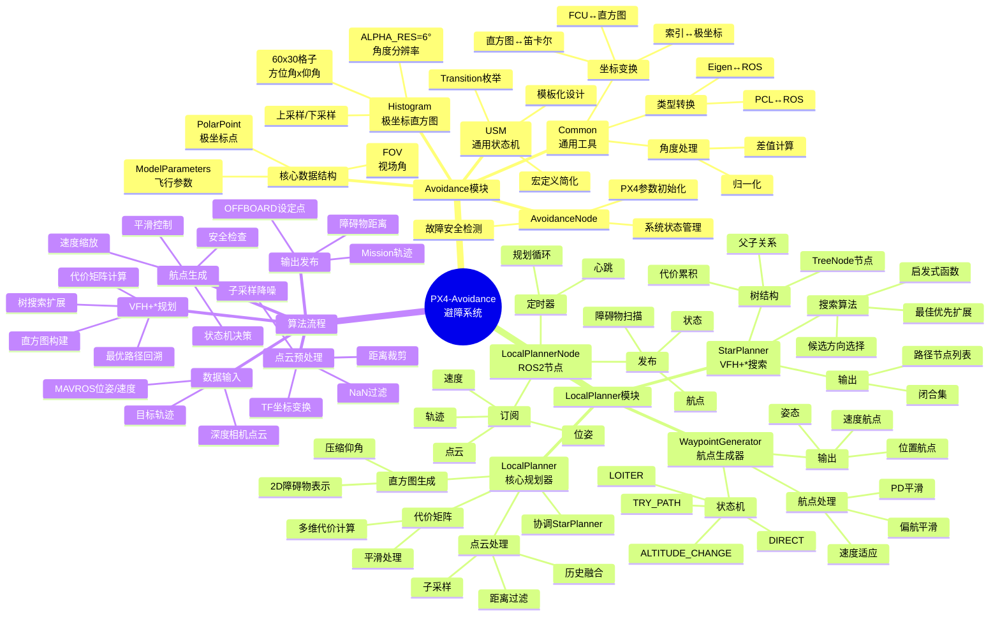

# PX4-Avoidance 代码分析文档

## 目录
1. [项目概述](#1-项目概述)
2. [整体架构](#2-整体架构)
3. [Avoidance 模块详解](#3-avoidance-模块详解)
4. [Local Planner 模块详解](#4-local-planner-模块详解)
5. [算法流程详解](#5-算法流程详解)
6. [思维导图](#6-思维导图)
7. [关键数据结构](#7-关键数据结构)
8. [代码文件详解](#8-代码文件详解)

---

## 1. 项目概述

PX4-Avoidance 是一个用于 PX4 无人机的自主避障系统。它使用 **VFH+*（Vector Field Histogram Star）** 算法来实现实时路径规划和障碍物规避。

### 核心功能
- **障碍物检测**：处理来自深度相机或激光雷达的点云数据
- **局部路径规划**：使用极坐标直方图和树形搜索算法
- **航点生成**：生成平滑的飞行路径
- **状态机管理**：处理不同飞行状态下的避障策略

---

## 2. 整体架构

### 2.1 模块依赖关系

```
┌─────────────────────────────────────────────────────────────────┐
│                         ROS2 节点层                              │
│  ┌─────────────────────────────────────────────────────────────┐│
│  │               LocalPlannerNode                              ││
│  │  - 订阅：位姿、速度、点云、轨迹                              ││
│  │  - 发布：航点、障碍物扫描、状态                               ││
│  └─────────────────────────────────────────────────────────────┘│
└─────────────────────────────────────────────────────────────────┘
                              │
                              ▼
┌─────────────────────────────────────────────────────────────────┐
│                        规划器层                                  │
│  ┌────────────────────┐    ┌───────────────────────┐           │
│  │   LocalPlanner     │───▶│    StarPlanner        │           │
│  │ - 点云处理          │    │ - VFH+* 树搜索         │           │
│  │ - 直方图生成        │    │ - 路径候选生成         │           │
│  │ - 代价矩阵计算      │    │ - 最优路径选择         │           │
│  └────────────────────┘    └───────────────────────┘           │
│           │                                                     │
│           ▼                                                     │
│  ┌────────────────────┐                                        │
│  │  WaypointGenerator │                                        │
│  │ - 状态机管理        │                                        │
│  │ - 航点平滑          │                                        │
│  │ - 速度适应          │                                        │
│  └────────────────────┘                                        │
└─────────────────────────────────────────────────────────────────┘
                              │
                              ▼
┌─────────────────────────────────────────────────────────────────┐
│                        基础库层 (Avoidance)                      │
│  ┌──────────────┐ ┌──────────────┐ ┌───────────────────────┐   │
│  │  Histogram   │ │   Common     │ │  TransformBuffer      │   │
│  │ - 极坐标直方图 │ │ - 坐标变换   │ │ - TF缓存管理           │   │
│  │ - 上/下采样  │ │ - 类型转换    │ │ - 变换插值             │   │
│  └──────────────┘ └──────────────┘ └───────────────────────┘   │
│  ┌──────────────┐ ┌──────────────┐                              │
│  │    USM       │ │AvoidanceNode │                              │
│  │ - 通用状态机 │ │ - 故障安全    │                              │
│  └──────────────┘ └──────────────┘                              │
└─────────────────────────────────────────────────────────────────┘
```

---

## 3. Avoidance 模块详解

Avoidance 模块提供核心的避障基础设施，包括数据结构、坐标变换和状态管理。

### 3.1 文件结构

```
avoidance/
├── include/avoidance/
│   ├── avoidance_node.h      # 避障节点接口
│   ├── common.h              # 通用工具和数据结构
│   ├── histogram.h           # 极坐标直方图
│   ├── transform_buffer.h    # TF变换缓存
│   └── usm.h                 # 通用状态机
└── src/
    ├── avoidance_node.cpp    # 避障节点实现
    ├── common.cpp            # 通用工具实现
    ├── histogram.cpp         # 直方图实现
    └── transform_buffer.cpp  # TF缓存实现
```

### 3.2 核心组件详解

#### 3.2.1 Histogram (极坐标直方图)

**文件**: `histogram.h` / `histogram.cpp`

极坐标直方图是 VFH 算法的核心数据结构，用于表示机器人周围的障碍物分布。

```cpp
// 直方图配置参数
const int ALPHA_RES = 6;                    // 角度分辨率（度）
const int GRID_LENGTH_Z = 360 / ALPHA_RES;  // 方位角方向的格子数 = 60
const int GRID_LENGTH_E = 180 / ALPHA_RES;  // 仰角方向的格子数 = 30
```

**核心方法**:

| 方法 | 功能描述 |
|------|----------|
| `get_dist(e, z)` | 获取 (仰角, 方位角) 处的障碍物距离 |
| `set_dist(e, z, value)` | 设置 (仰角, 方位角) 处的障碍物距离 |
| `upsample()` | 上采样：将低分辨率直方图转换为高分辨率 |
| `downsample()` | 下采样：将高分辨率直方图转换为低分辨率 |
| `setZero()` | 清空直方图 |
| `isEmpty()` | 检查直方图是否为空 |

**直方图坐标系**:
```
      仰角 (Elevation)
        ▲  +90°
        │
        │    障碍物
        │     ●
        │
  ------+------▶ 方位角 (Azimuth)
   -180°│      +180°
        │
        ▼  -90°
```

#### 3.2.2 Common (通用工具)

**文件**: `common.h` / `common.cpp`

提供坐标变换、类型转换和数学工具。

**核心数据结构**:

```cpp
// 极坐标点
struct PolarPoint {
    float e;  // 仰角 (elevation): [-90, 90] 度
    float z;  // 方位角 (azimuth): [-180, 180] 度
    float r;  // 距离 (radius): 米
};

// 视场角 (Field of View)
struct FOV {
    float yaw_deg;    // 相机偏航角
    float pitch_deg;  // 相机俯仰角
    float h_fov_deg;  // 水平视场角
    float v_fov_deg;  // 垂直视场角
};

// 模型参数 (PX4 固件参数)
struct ModelParameters {
    float param_mpc_acc_hor;      // 最大水平加速度
    float param_mpc_xy_cruise;    // 巡航速度
    float param_cp_dist;          // 碰撞防护距离
    // ... 更多参数
};
```

**核心函数**:

| 函数 | 功能 |
|------|------|
| `polarHistogramToCartesian()` | 直方图极坐标 → 笛卡尔坐标 |
| `cartesianToPolarHistogram()` | 笛卡尔坐标 → 直方图极坐标 |
| `cartesianToPolarFCU()` | 笛卡尔坐标 → FCU极坐标 |
| `polarToHistogramIndex()` | 极坐标 → 直方图索引 |
| `histogramIndexToPolar()` | 直方图索引 → 极坐标 |
| `pointInsideFOV()` | 判断点是否在视场内 |
| `wrapAngleToPlusMinusPI()` | 角度归一化到 [-π, π] |
| `getYawFromQuaternion()` | 从四元数提取偏航角 |

**坐标系转换示意**:
```
直方图坐标系:              FCU坐标系:
  Y▲                        X▲(前)
   │  +方位角                │
   │  ↗                     │
   └────▶X               Y◀─┴─▶
   0°在Y轴正方向            0°在X轴正方向
   顺时针为正               逆时针为正
```

#### 3.2.3 USM (通用状态机)

**文件**: `usm.h`

一个模板化的状态机框架，支持灵活的状态转换。

```cpp
enum class Transition { REPEAT, NEXT1, NEXT2, NEXT3, NEXT4, ERROR };

template <typename StateEnum>
class StateMachine {
 public:
  void iterateOnce();              // 执行一次状态机迭代
  StateEnum getState();            // 获取当前状态
  
 protected:
  virtual Transition runCurrentState() = 0;    // 执行当前状态逻辑
  virtual StateEnum chooseNextState(...) = 0;  // 选择下一个状态
};
```

**状态转换宏**:
```cpp
// 使用宏简化状态转换表定义
USM_TABLE(current_state, error_state,
  USM_STATE(transition, STATE_A,
    USM_MAP(NEXT1, STATE_B);
    USM_MAP(NEXT2, STATE_C));
  USM_STATE(transition, STATE_B,
    USM_MAP(NEXT1, STATE_A)));
```

#### 3.2.4 AvoidanceNode (避障节点)

**文件**: `avoidance_node.h` / `avoidance_node.cpp`

管理避障系统的健康状态和与 PX4 的通信。

**核心功能**:

```cpp
class AvoidanceNode {
 public:
  // 检查故障安全状态
  void checkFailsafe(rclcpp::Duration since_last_cloud, 
                     rclcpp::Duration since_start, 
                     bool& hover);
  
  // 获取/设置系统状态
  MAV_STATE getSystemStatus();
  void setSystemStatus(MAV_STATE state);
};
```

**状态转换逻辑**:
```
正常运行 ──点云超时──▶ 悬停 ──持续超时──▶ 终止
    │                    │
    └─────恢复─────────◀┘
```

---

## 4. Local Planner 模块详解

Local Planner 是核心的路径规划模块，实现了完整的 VFH+* 算法。

### 4.1 文件结构

```
local_planner/
├── include/local_planner/
│   ├── local_planner_node.h          # ROS2 节点
│   ├── local_planner.h               # 核心规划器
│   ├── star_planner.h                # VFH+* 树搜索
│   ├── waypoint_generator.h          # 航点生成器
│   ├── planner_functions.h           # 规划辅助函数
│   ├── tree_node.h                   # 搜索树节点
│   ├── cost_parameters.h             # 代价函数参数
│   ├── candidate_direction.h         # 候选方向
│   └── avoidance_output.h            # 规划输出
└── src/nodes/
    ├── local_planner_node.cpp        # 节点实现
    ├── local_planner.cpp             # 规划器实现
    ├── star_planner.cpp              # 树搜索实现
    ├── waypoint_generator.cpp        # 航点生成实现
    ├── planner_functions.cpp         # 辅助函数实现
    └── tree_node.cpp                 # 树节点实现
```

### 4.2 核心组件详解

#### 4.2.1 LocalPlannerNode (ROS2 节点)

**文件**: `local_planner_node.h` / `local_planner_node.cpp`

ROS2 节点，负责数据的订阅、发布和定时器管理。

**订阅话题**:
| 话题 | 消息类型 | 描述 |
|------|----------|------|
| `/mavros/local_position/pose` | `PoseStamped` | 无人机位姿 |
| `/mavros/local_position/velocity_local` | `TwistStamped` | 无人机速度 |
| `/mavros/trajectory/desired` | `Trajectory` | 期望轨迹 |
| `/mavros/state` | `State` | 飞控状态 |
| `/cloud_in` | `PointCloud2` | 点云数据 |

**发布话题**:
| 话题 | 消息类型 | 描述 |
|------|----------|------|
| `/mavros/setpoint_position/local` | `PoseStamped` | 位置设定点 |
| `/local_planner/obstacle_scan` | `LaserScan` | 障碍物距离 |
| `/mavros/companion_process/status` | `CompanionProcessStatus` | 系统状态 |
| `/mavros/trajectory/generated` | `Trajectory` | 生成的轨迹 |

**主循环流程**:
```cpp
void LocalPlannerNode::onTimer() {
    // 1. 获取输入数据快照
    // 2. 转换点云坐标系
    // 3. 更新 FOV 信息
    // 4. 设置规划器状态
    // 5. 运行规划器
    // 6. 生成航点
    // 7. 发布结果
}
```

**参数配置**:
```cpp
struct Params {
    float max_sensor_range = 15.0f;           // 最大感知距离
    float min_sensor_range = 0.2f;            // 最小感知距离
    float pitch_cost_param = 25.0f;           // 俯仰代价权重
    float yaw_cost_param = 3.0f;              // 偏航代价权重
    float velocity_cost_param = 6000.0f;      // 速度代价权重
    float obstacle_cost_param = 8.5f;         // 障碍物代价权重
    float tree_heuristic_weight = 35.0f;      // 树搜索启发权重
    int children_per_node = 8;                // 每节点子节点数
    int n_expanded_nodes = 40;                // 扩展节点数
    float tree_node_distance = 2.0f;          // 树节点间距
};
```

#### 4.2.2 LocalPlanner (核心规划器)

**文件**: `local_planner.h` / `local_planner.cpp`

核心规划逻辑，协调点云处理、直方图生成和路径搜索。

**核心方法**:

```cpp
class LocalPlanner {
 public:
  // 设置状态
  void setState(const Eigen::Vector3f& pos, 
                const Eigen::Vector3f& vel, 
                const Eigen::Quaternionf& q);
  void setGoal(const Eigen::Vector3f& goal);
  
  // 运行规划
  void runPlanner();
  
  // 获取输出
  avoidanceOutput getAvoidanceOutput() const;
};
```

**runPlanner() 流程**:
```
1. processPointcloud()      ──▶ 处理点云数据
                                - 距离过滤
                                - 子采样
                                - 与历史数据融合
                                
2. determineStrategy()      ──▶ 确定避障策略
   ├── create2DObstacleRepresentation()  生成直方图
   ├── getCostMatrix()                    计算代价矩阵
   └── star_planner_->buildLookAheadTree() 构建搜索树
```

**代价矩阵计算**:
```
总代价 = 距离代价 + 偏航代价 + 俯仰代价 + 速度代价

距离代价: 与障碍物的接近程度
偏航代价: 偏离目标方向的角度
俯仰代价: 高度变化的代价
速度代价: 与当前速度方向的一致性
```

#### 4.2.3 StarPlanner (VFH+* 树搜索)

**文件**: `star_planner.h` / `star_planner.cpp`

实现 VFH+* 算法的核心树搜索。

**算法原理**:

VFH+* 是 VFH+ 算法的扩展，通过构建前瞻树来选择最优路径：

1. **根节点**：当前位置
2. **扩展**：从代价最低的节点扩展子节点
3. **评估**：使用启发式函数评估每个节点
4. **选择**：选择最深且代价最低的路径

**buildLookAheadTree() 流程**:

```cpp
void StarPlanner::buildLookAheadTree() {
    // 1. 初始化：插入根节点（当前位置）
    tree_.push_back(TreeNode(0, position_, velocity_));
    
    // 2. 循环扩展节点
    for (int n = 0; n < n_expanded_nodes_ && is_expanded_node; n++) {
        // 2.1 获取当前节点位置
        Eigen::Vector3f origin_position = tree_[origin].getPosition();
        
        // 2.2 生成以该位置为中心的直方图
        generateNewHistogram(histogram, cloud_, origin_position);
        
        // 2.3 计算代价矩阵
        getCostMatrix(histogram, goal_, origin_position, ...);
        
        // 2.4 获取最佳候选方向
        getBestCandidatesFromCostMatrix(cost_matrix, children_per_node_, 
                                        candidate_vector);
        
        // 2.5 为每个候选方向创建子节点
        for (candidateDirection candidate : candidate_vector) {
            // 计算节点位置
            Eigen::Vector3f node_location = polarHistogramToCartesian(
                candidate_polar, origin_position);
            
            // 添加到树
            tree_.push_back(TreeNode(origin, node_location, node_velocity));
            
            // 计算总代价 = 父节点代价 + 候选代价 + 启发式
            tree_.back().total_cost_ = tree_[origin].total_cost_ 
                                     - tree_[origin].heuristic_ 
                                     + candidate.cost + h;
        }
        
        // 2.6 选择代价最低的未闭合节点继续扩展
        for (size_t i = 0; i < tree_.size(); i++) {
            if (!(tree_[i].closed_) && tree_[i].total_cost_ < minimal_cost) {
                origin = i;
            }
        }
    }
    
    // 3. 回溯找到最优路径
    int tree_end = max_depth_index;
    while (tree_end > 0) {
        path_node_positions_.push_back(tree_[tree_end].getPosition());
        tree_end = tree_[tree_end].origin_;
    }
}
```

**启发式函数**:
```cpp
float StarPlanner::treeHeuristicFunction(int node_number) const {
    // 到目标的欧氏距离乘以权重
    return (goal_ - tree_[node_number].getPosition()).norm() 
           * tree_heuristic_weight_;
}
```

#### 4.2.4 WaypointGenerator (航点生成器)

**文件**: `waypoint_generator.h` / `waypoint_generator.cpp`

基于状态机的航点生成器，将规划结果转换为平滑的飞行指令。

**状态机状态**:

```cpp
enum class PlannerState { 
    TRY_PATH,        // 尝试按规划路径飞行
    ALTITUDE_CHANGE, // 高度变化状态
    LOITER,          // 悬停状态
    DIRECT           // 直接飞向目标
};
```

**状态转换图**:
```
                    ┌─────────────────────┐
                    │                     │
                    ▼                     │
              ┌──────────┐    路径可用     │
    ┌────────▶│ TRY_PATH │◀──────────────┐│
    │         └──────────┘               ││
    │              │                     ││
    │   高度变化   │   路径不可用/悬停   ││
    │              ▼                     ││
    │    ┌─────────────────┐             ││
    │    │ ALTITUDE_CHANGE │             ││
    │    └─────────────────┘             ││
    │              │                     ││
    │    高度达到  │   悬停              ││
    │              ▼                     ││
    │         ┌────────┐                 ││
    └─────────│ LOITER │─────────────────┘│
              └────────┘                   │
                   │                       │
                   │   取消悬停            │
                   ▼                       │
              ┌────────┐                   │
              │ DIRECT │───────────────────┘
              └────────┘   路径可用
```

**各状态行为**:

| 状态 | 行为 | 转换条件 |
|------|------|----------|
| TRY_PATH | 沿规划路径飞行 | 路径不可用→DIRECT, 需变高度→ALTITUDE_CHANGE, 悬停→LOITER |
| ALTITUDE_CHANGE | 垂直调整高度 | 高度达到→TRY_PATH, 悬停→LOITER |
| LOITER | 保持当前位置 | 取消悬停→TRY_PATH |
| DIRECT | 直线飞向目标 | 路径可用→TRY_PATH, 需变高度→ALTITUDE_CHANGE |

**航点平滑**:
```cpp
void WaypointGenerator::smoothWaypoint(float dt) {
    // 临界阻尼 PD 控制器
    const Eigen::Array3f P_constant(smoothing_speed_xy_, smoothing_speed_xy_, smoothing_speed_z_);
    const Eigen::Array3f D_constant = 2 * P_constant.sqrt();  // 临界阻尼
    
    // 计算误差
    Eigen::Vector3f location_diff = desired_location - smoothed_goto_location_;
    Eigen::Vector3f velocity_diff = desired_velocity - smoothed_goto_location_velocity_;
    
    // PD 控制
    const Eigen::Vector3f p = location_diff.array() * P_constant;
    const Eigen::Vector3f d = velocity_diff.array() * D_constant;
    
    // 更新平滑位置
    smoothed_goto_location_velocity_ += (p + d) * dt;
    smoothed_goto_location_ += smoothed_goto_location_velocity_ * dt;
}
```

#### 4.2.5 Planner Functions (规划辅助函数)

**文件**: `planner_functions.h` / `planner_functions.cpp`

提供点云处理、直方图生成、代价计算等核心算法。

**processPointcloud() - 点云处理**:

```cpp
void processPointcloud(
    pcl::PointCloud<pcl::PointXYZI>& final_cloud,     // 输出：处理后的点云
    const std::vector<pcl::PointCloud<pcl::PointXYZ>>& complete_cloud,  // 输入：原始点云
    const std::vector<FOV>& fov,                       // 相机FOV
    float yaw_fcu_frame_deg, float pitch_fcu_frame_deg,
    const Eigen::Vector3f& position,
    float min_sensor_range, float max_sensor_range,
    float max_age, float elapsed_s,
    int min_num_points_per_cell)
{
    // 1. 距离过滤：保留在传感器范围内的点
    // 2. 子采样：每个直方图格子只保留一定数量的点
    // 3. 与历史数据融合：保留FOV外的旧点（带时间衰减）
}
```

**generateNewHistogram() - 直方图生成**:

```cpp
void generateNewHistogram(
    Histogram& polar_histogram,
    const pcl::PointCloud<pcl::PointXYZI>& cropped_cloud,
    const Eigen::Vector3f& position)
{
    for (auto xyz : cropped_cloud) {
        // 1. 计算点的极坐标
        PolarPoint p_pol = cartesianToPolarHistogram(xyz, position);
        
        // 2. 计算直方图索引
        Eigen::Vector2i p_ind = polarToHistogramIndex(p_pol, ALPHA_RES);
        
        // 3. 累加距离
        polar_histogram.set_dist(p_ind.y(), p_ind.x(), 
            polar_histogram.get_dist(p_ind.y(), p_ind.x()) + dist);
    }
    
    // 4. 计算平均距离
    for (int e = 0; e < GRID_LENGTH_E; e++) {
        for (int z = 0; z < GRID_LENGTH_Z; z++) {
            if (counter(e, z) > 0) {
                polar_histogram.set_dist(e, z, 
                    polar_histogram.get_dist(e, z) / counter(e, z));
            }
        }
    }
}
```

**costFunction() - 代价函数**:

```cpp
std::pair<float, float> costFunction(
    const PolarPoint& candidate_polar,    // 候选方向
    float obstacle_distance,              // 该方向的障碍物距离
    const Eigen::Vector3f& goal,          // 目标位置
    const Eigen::Vector3f& position,      // 当前位置
    const Eigen::Vector3f& velocity,      // 当前速度
    const costParameters& cost_params,    // 代价权重参数
    const Eigen::Vector3f& closest_pt,    // 路径上最近点
    const bool is_obstacle_facing_goal)   // 目标方向是否有障碍
{
    // 1. 偏航代价：与目标方向的角度差
    float yaw_cost = cost_params.yaw_cost_param * angle_diff * angle_diff;
    
    // 2. 俯仰代价：与目标高度的差异
    float pitch_cost = cost_params.pitch_cost_param 
                     * (candidate_polar.e - facing_goal.e)²;
    
    // 3. 速度代价：与当前速度方向的一致性
    float velocity_cost = cost_params.velocity_cost_param 
                        * (velocity.norm() - candidate.dot(velocity));
    
    // 4. 距离代价：与障碍物的接近程度（非线性）
    float d = cost_params.obstacle_cost_param - obstacle_distance;
    float distance_cost = obstacle_distance > 0 
                        ? 5000.0f * (1 + d / sqrt(1 + d*d)) : 0.0f;
    
    return {distance_cost, velocity_cost + yaw_cost + pitch_cost};
}
```

---

## 5. 算法流程详解

### 5.1 完整数据流

```
┌──────────────────────────────────────────────────────────────────┐
│                         传感器输入                                │
│  ┌─────────────┐    ┌─────────────┐    ┌─────────────┐          │
│  │  深度相机    │    │   位姿数据   │    │   目标点     │          │
│  │  PointCloud │    │  PoseStamped │    │ Trajectory  │          │
│  └──────┬──────┘    └──────┬──────┘    └──────┬──────┘          │
└─────────│───────────────────│───────────────────│────────────────┘
          │                   │                   │
          ▼                   ▼                   ▼
┌──────────────────────────────────────────────────────────────────┐
│                    LocalPlannerNode::onTimer()                    │
│  1. 坐标变换 (TF)                                                  │
│  2. 更新 FOV                                                       │
│  3. 调用 planner_.runPlanner()                                    │
└─────────│────────────────────────────────────────────────────────┘
          │
          ▼
┌──────────────────────────────────────────────────────────────────┐
│                    LocalPlanner::runPlanner()                     │
│                                                                   │
│  ┌─────────────────────────────────────────────────────────────┐ │
│  │ processPointcloud()                                          │ │
│  │  - 距离过滤: min_range < d < max_range                       │ │
│  │  - 子采样: 每格子保留 min_num_points_per_cell 个点            │ │
│  │  - 历史融合: 保留FOV外的旧点 (intensity=age)                  │ │
│  └─────────────────────────────────────────────────────────────┘ │
│                              │                                    │
│                              ▼                                    │
│  ┌─────────────────────────────────────────────────────────────┐ │
│  │ determineStrategy()                                          │ │
│  │  ├─ create2DObstacleRepresentation() → 生成极坐标直方图       │ │
│  │  ├─ getCostMatrix() → 计算代价矩阵                           │ │
│  │  └─ star_planner_->buildLookAheadTree() → VFH+* 树搜索       │ │
│  └─────────────────────────────────────────────────────────────┘ │
└─────────│────────────────────────────────────────────────────────┘
          │
          ▼
┌──────────────────────────────────────────────────────────────────┐
│                    StarPlanner::buildLookAheadTree()              │
│                                                                   │
│  初始: tree_ = [根节点(当前位置)]                                  │
│                                                                   │
│  循环 (n_expanded_nodes 次):                                      │
│    1. 选择代价最低的未闭合节点                                     │
│    2. 生成该位置的直方图                                           │
│    3. 计算代价矩阵                                                 │
│    4. 获取 children_per_node 个最佳候选方向                        │
│    5. 为每个候选创建子节点                                         │
│    6. 标记当前节点为已闭合                                         │
│                                                                   │
│  结果: path_node_positions_ = 从根到最深节点的路径                 │
└─────────│────────────────────────────────────────────────────────┘
          │
          ▼
┌──────────────────────────────────────────────────────────────────┐
│                    WaypointGenerator::getWaypoints()              │
│                                                                   │
│  状态机迭代:                                                       │
│    TRY_PATH:                                                      │
│      - getSetpointFromPath() 从路径获取当前应到达的点              │
│      - 根据条件转换到其他状态                                      │
│    ALTITUDE_CHANGE:                                               │
│      - 垂直调整高度                                                │
│    LOITER:                                                        │
│      - 保持当前位置                                                │
│    DIRECT:                                                        │
│      - 直线飞向目标                                                │
│                                                                   │
│  后处理:                                                          │
│    - adaptSpeed(): 根据障碍物和目标距离调整速度                     │
│    - smoothWaypoint(): PD控制器平滑航点                            │
│    - nextSmoothYaw(): 平滑偏航角                                   │
└─────────│────────────────────────────────────────────────────────┘
          │
          ▼
┌──────────────────────────────────────────────────────────────────┐
│                           输出发布                                 │
│  ┌─────────────────┐  ┌─────────────────┐  ┌─────────────────┐  │
│  │ setpoint_pub_   │  │ trajectory_pub_ │  │ obstacle_scan_  │  │
│  │ (OFFBOARD模式)  │  │ (Mission模式)   │  │ (障碍物距离)     │  │
│  └─────────────────┘  └─────────────────┘  └─────────────────┘  │
└──────────────────────────────────────────────────────────────────┘
```

### 5.2 VFH+* 算法图解

```
步骤1: 生成极坐标直方图
═══════════════════════

点云数据                    极坐标直方图
    ●  ●                   ┌─────────────────────┐
      ●   ●                │     █ █             │  仰角
   ●     ○→目标            │   █ █ █ █           │   ▲
      ● ●                  │ █ █ █ █ █ █         │   │
         ●                 │   █ █ █             │   │
                           └─────────────────────┘
○ = 无人机位置                    方位角 →

直方图中，每个格子的值表示该方向上最近障碍物的距离


步骤2: 计算代价矩阵
═══════════════════

代价 = 距离代价 + 偏航代价 + 俯仰代价 + 速度代价

┌─────────────────────────────────────────────────┐
│  低代价区域(可通行)    │    高代价区域(有障碍物) │
│         ▓▓            │      ████████████      │
│       ▓▓▓▓            │    ████████████████    │
│     ▓▓▓▓▓▓▓▓          │  ████████████████████  │
│   ▓▓▓▓▓▓▓▓▓▓▓▓        │    ████████████████    │
│     ▓▓▓▓▓▓▓▓  ★目标   │      ████████████      │
│       ▓▓▓▓            │                        │
└─────────────────────────────────────────────────┘


步骤3: 构建搜索树
═══════════════════

                    ○ 起点
                   /│\
                  / │ \
                 ●  ●  ●      第1层展开
                /\  │  /\
               ● ● ● ● ● ●    第2层展开
              /   \│/   \
             ●     ●     ●    第3层展开
                   │
                   ▼
                 ★ 目标

每一层：
1. 选择代价最低的节点
2. 展开 children_per_node 个子节点
3. 计算每个子节点的总代价


步骤4: 选择最优路径
═══════════════════

从最深的节点回溯到根节点

      ○ ─ ─ ─ ● ─ ─ ─ ●      
      │               │
      ●               ●       
      │               │
      ● ═══════════▶ ★ 目标
      ↑
    选中路径
```

---

## 6. 思维导图



---

## 7. 关键数据结构

### 7.1 输入数据结构

```cpp
// 点云输入
sensor_msgs::msg::PointCloud2  // ROS2 点云消息

// 位姿输入
geometry_msgs::msg::PoseStamped {
    header;
    pose {
        position {x, y, z};
        orientation {x, y, z, w};
    };
};

// 速度输入
geometry_msgs::msg::TwistStamped {
    header;
    twist {
        linear {x, y, z};
        angular {x, y, z};
    };
};

// 轨迹输入
mavros_msgs::msg::Trajectory {
    header;
    type;
    point_1, point_2, point_3, point_4, point_5;  // 轨迹点
    point_valid[5];  // 有效标志
    command[5];      // 命令（着陆/起飞等）
};
```

### 7.2 中间数据结构

```cpp
// 极坐标直方图
class Histogram {
    int resolution_;     // 角度分辨率
    int z_dim_, e_dim_;  // 方位角/仰角维度
    Eigen::MatrixXf dist_;  // 距离矩阵
};

// 代价矩阵
Eigen::MatrixXf cost_matrix_;  // GRID_LENGTH_E x GRID_LENGTH_Z

// 搜索树节点
class TreeNode {
    Eigen::Vector3f position_;  // 节点位置
    Eigen::Vector3f velocity_;  // 节点速度
    float total_cost_;          // 总代价
    float heuristic_;           // 启发值
    int origin_;                // 父节点索引
    bool closed_;               // 是否已闭合
    int depth_;                 // 深度
};

// 候选方向
struct candidateDirection {
    float cost;         // 代价
    float elevation_angle;  // 仰角
    float azimuth_angle;    // 方位角
};
```

### 7.3 输出数据结构

```cpp
// 规划输出
struct avoidanceOutput {
    float cruise_velocity;                      // 巡航速度
    rclcpp::Time last_path_time;               // 路径生成时间
    std::vector<Eigen::Vector3f> path_node_positions;  // 路径节点
};

// 航点输出
struct waypointResult {
    PlannerState waypoint_type;           // 当前状态
    Eigen::Vector3f position_wp;          // 位置航点
    Eigen::Quaternionf orientation_wp;    // 姿态航点
    Eigen::Vector3f linear_velocity_wp;   // 速度航点
    Eigen::Vector3f angular_velocity_wp;  // 角速度
    Eigen::Vector3f goto_position;        // 原始目标
    Eigen::Vector3f adapted_goto_position;   // 速度适应后
    Eigen::Vector3f smoothed_goto_position;  // 平滑后
};
```

---

## 8. 代码文件详解

### 8.1 Avoidance 模块文件

#### `avoidance/include/avoidance/histogram.h`

```cpp
// 极坐标直方图类定义
// 
// 用途：存储机器人周围障碍物的2D极坐标表示
// 
// 关键参数：
// - ALPHA_RES = 6：角度分辨率，每6度一个格子
// - GRID_LENGTH_Z = 60：方位角方向格子数 (360/6)
// - GRID_LENGTH_E = 30：仰角方向格子数 (180/6)
//
// 数据存储：
// - dist_矩阵：每个格子存储该方向上最近障碍物的距离
// - 距离为0表示该方向无障碍物

class Histogram {
    // 获取/设置指定方向的障碍物距离
    float get_dist(int e, int z) const;
    void set_dist(int e, int z, float value);
    
    // 分辨率转换
    void upsample();    // 低分辨率 → 高分辨率
    void downsample();  // 高分辨率 → 低分辨率
};
```

#### `avoidance/include/avoidance/common.h`

```cpp
// 通用数据结构和工具函数
//
// 核心结构体：
// - PolarPoint：极坐标点 (仰角, 方位角, 距离)
// - FOV：相机视场角定义
// - ModelParameters：PX4飞行参数
//
// 坐标变换函数：
// - polarHistogramToCartesian()：直方图极坐标 → 笛卡尔
// - cartesianToPolarHistogram()：笛卡尔 → 直方图极坐标
// - cartesianToPolarFCU()：笛卡尔 → FCU极坐标
//
// FOV判断函数：
// - pointInsideFOV()：判断点是否在视场内
// - histogramIndexYawInsideFOV()：判断直方图格子是否在视场内
// - scaleToFOV()：根据FOV边缘计算缩放因子
//
// 类型转换内联函数：
// - toEigen()：ROS消息 → Eigen向量
// - toPoint()：Eigen向量 → ROS Point
// - toQuaternion()：Eigen四元数 → ROS Quaternion
```

#### `avoidance/include/avoidance/usm.h`

```cpp
// 通用状态机 (Universal State Machine)
//
// 设计模式：模板方法模式
// 
// 使用方式：
// 1. 定义状态枚举
// 2. 继承StateMachine<StateEnum>
// 3. 实现runCurrentState()和chooseNextState()
//
// 转换类型：
// - REPEAT：保持当前状态
// - NEXT1/NEXT2/NEXT3/NEXT4：转换到预定义的下一个状态
// - ERROR：错误状态
//
// 宏定义简化状态转换表：
// - USM_TABLE：定义状态表
// - USM_STATE：定义单个状态的转换
// - USM_MAP：定义转换映射
```

#### `avoidance/src/common.cpp`

```cpp
// 通用函数实现
//
// 坐标变换实现：
// - 直方图坐标系：Y轴正方向为0°，顺时针为正
// - FCU坐标系：X轴正方向为0°，逆时针为正
//
// 关键算法：
// - wrapPolar()：极坐标角度归一化
//   - 仰角限制在[-90, 90)
//   - 方位角限制在[-180, 180)
//   - 超出范围时自动翻转
//
// - removeNaNAndGetMaxima()：点云预处理
//   - 移除NaN点
//   - 记录边界点用于FOV估计
//
// - transformToTrajectory()：生成PX4轨迹消息
```

### 8.2 Local Planner 模块文件

#### `local_planner/include/local_planner/local_planner_node.h`

```cpp
// ROS2 节点类定义
//
// 职责：
// - 管理ROS2订阅和发布
// - 协调各组件的调用
// - 参数声明和加载
//
// 关键成员：
// - planner_：LocalPlanner实例
// - waypoint_generator_：WaypointGenerator实例
// - tf_buffer_/tf_listener_：TF变换管理
//
// 回调函数：
// - poseCallback()：处理位姿更新
// - velocityCallback()：处理速度更新
// - cloudCallback()：处理点云数据
// - trajectoryCallback()：处理目标轨迹
// - stateCallback()：处理飞控状态
// - onTimer()：主规划循环
```

#### `local_planner/include/local_planner/local_planner.h`

```cpp
// 核心规划器类定义
//
// 主要功能：
// - 点云处理和直方图生成
// - 代价矩阵计算
// - 协调StarPlanner进行路径搜索
//
// 关键方法：
// - setState()：更新无人机状态
// - setGoal()：设置目标点
// - runPlanner()：执行规划循环
// - getAvoidanceOutput()：获取规划结果
//
// 内部组件：
// - star_planner_：VFH+*搜索器
// - polar_histogram_：当前直方图
// - cost_matrix_：代价矩阵
// - final_cloud_：处理后的点云
```

#### `local_planner/include/local_planner/star_planner.h`

```cpp
// VFH+* 搜索器类定义
//
// 算法核心：
// - 构建前瞻搜索树
// - 评估每个方向的代价
// - 选择最优路径
//
// 关键参数：
// - children_per_node_：每个节点的子节点数
// - n_expanded_nodes_：最大扩展节点数
// - tree_node_distance_：节点间距
// - tree_heuristic_weight_：启发式权重
//
// 输出：
// - path_node_positions_：最优路径的节点位置列表
// - tree_：完整的搜索树
// - closed_set_：已闭合节点集合
```

#### `local_planner/include/local_planner/waypoint_generator.h`

```cpp
// 航点生成器类定义
//
// 继承自：usm::StateMachine<PlannerState>
//
// 状态定义：
// - TRY_PATH：尝试沿规划路径飞行
// - ALTITUDE_CHANGE：调整高度
// - LOITER：悬停
// - DIRECT：直线飞行
//
// 关键方法：
// - getWaypoints()：获取生成的航点
// - updateState()：更新飞行状态
// - setPlannerInfo()：设置规划器输出
//
// 平滑控制：
// - smoothWaypoint()：位置平滑 (PD控制)
// - nextSmoothYaw()：偏航平滑 (PD控制)
// - adaptSpeed()：速度适应
```

#### `local_planner/include/local_planner/planner_functions.h`

```cpp
// 规划辅助函数声明
//
// 点云处理：
// - processPointcloud()：完整的点云预处理流程
//
// 直方图操作：
// - generateNewHistogram()：从点云生成直方图
// - compressHistogramElevation()：压缩仰角维度
//
// 代价计算：
// - getCostMatrix()：生成代价矩阵
// - costFunction()：单点代价计算
// - getBestCandidatesFromCostMatrix()：提取最佳候选
//
// 矩阵处理：
// - smoothPolarMatrix()：平滑代价矩阵
// - padPolarMatrix()：边界填充
//
// 路径处理：
// - getSetpointFromPath()：从路径获取当前设定点
```

#### `local_planner/src/nodes/local_planner_node.cpp`

```cpp
// ROS2 节点实现
//
// 初始化流程：
// 1. 声明和加载参数
// 2. 设置发布者和订阅者
// 3. 创建定时器
// 4. 初始化规划器和航点生成器
//
// onTimer()主循环：
// 1. 锁定数据互斥量，获取输入快照
// 2. 检查数据有效性
// 3. 转换点云到规划坐标系
// 4. 更新FOV信息
// 5. 设置规划器状态和目标
// 6. 调用planner_.runPlanner()
// 7. 获取规划输出
// 8. 更新航点生成器状态
// 9. 获取并发布航点
// 10. 发布障碍物距离数据
// 11. 可视化（如果启用）
```

#### `local_planner/src/nodes/local_planner.cpp`

```cpp
// 核心规划器实现
//
// runPlanner()流程：
// 1. 计算距离上次处理的时间间隔
// 2. 调用processPointcloud()处理点云
// 3. 调用determineStrategy()确定策略
//
// determineStrategy()流程：
// 1. 清空代价图像数据
// 2. 调用create2DObstacleRepresentation()生成直方图
// 3. 计算最近点投影（用于路径跟踪）
// 4. 如果直方图非空：
//    - 调用getCostMatrix()计算代价
//    - 配置StarPlanner
//    - 调用buildLookAheadTree()构建搜索树
//
// getAvoidanceOutput()：
// 1. 计算基于传感器范围和飞行参数的最大速度
// 2. 返回路径节点和时间戳
```

#### `local_planner/src/nodes/star_planner.cpp`

```cpp
// VFH+* 搜索实现
//
// buildLookAheadTree()算法：
//
// 初始化：
// - 清空树和闭合集
// - 添加根节点（当前位置）
// - 设置根节点代价为启发值
//
// 主循环（最多n_expanded_nodes次）：
//   1. 获取当前节点位置和速度
//   2. 生成以该位置为中心的直方图
//   3. 计算代价矩阵
//   4. 获取children_per_node个最佳候选
//   5. 为每个候选创建子节点：
//      - 计算节点位置
//      - 检查是否与已有节点重复
//      - 计算总代价 = 父代价 - 父启发 + 候选代价 + 当前启发
//   6. 将当前节点加入闭合集
//   7. 选择代价最低的未闭合节点作为下一个扩展节点
//
// 路径提取：
// - 找到最深的未闭合节点
// - 从该节点回溯到根节点
// - 存储路径到path_node_positions_
```

#### `local_planner/src/nodes/waypoint_generator.cpp`

```cpp
// 航点生成器实现
//
// 状态机实现：
//
// runTryPath()：
// - 从规划路径获取设定点
// - 如果路径可用，沿路径飞行
// - 否则转换到DIRECT或其他状态
//
// runAltitudeChange()：
// - OFFBOARD模式：直接调整z坐标
// - Mission模式：先减速再调整高度
// - 保持x/y位置不变
//
// runLoiter()：
// - 记录并保持当前位置
// - 等待取消悬停信号
//
// runDirect()：
// - 直线飞向目标
// - 持续检查是否有新路径可用
//
// 平滑控制实现：
//
// smoothWaypoint()：
// - 使用临界阻尼PD控制器
// - 分离xy和z的平滑参数
// - 公式：加速度 = P*(位置误差) + D*(速度误差)
//
// adaptSpeed()：
// - 根据FOV可见性缩放速度
// - 接近目标时减速
// - 低通滤波平滑速度变化
```

#### `local_planner/src/nodes/planner_functions.cpp`

```cpp
// 规划辅助函数实现
//
// processPointcloud()实现：
// 1. 初始化计数器矩阵
// 2. 遍历新点云：
//    - 距离过滤
//    - 计算极坐标和直方图索引
//    - 累计点数，达到阈值时添加到final_cloud
// 3. 合并旧点云：
//    - 检查点是否在FOV外
//    - 检查年龄是否超过max_age
//    - 检查对应格子是否已被新点占据
//    - 满足条件则保留，年龄+elapsed_s
//
// getCostMatrix()实现：
// 1. 检测目标方向是否有障碍物
// 2. 遍历直方图每个格子：
//    - 计算该方向的代价
//    - 考虑仰角导致的采样密度变化
//    - 线性插值填充未计算的格子
// 3. 对距离代价矩阵进行平滑
// 4. 合并距离代价和其他代价
//
// costFunction()实现：
// 代价组成：
// 1. 距离代价：5000 * (1 + d/sqrt(1+d²))，d = 参数 - 障碍物距离
// 2. 偏航代价：yaw_weight * angle_diff²
// 3. 俯仰代价：pitch_weight * elevation_diff²（接近目标时增加）
// 4. 速度代价：vel_weight * (速度大小 - 方向一致性)
// 5. 路径跟踪代价：回到前一目标-当前目标连线
//
// getSetpointFromPath()实现：
// - 根据速度和时间计算应该到达的路径位置
// - 沿路径线性插值
// - 如果超出路径末端，返回false表示路径无效
```

---

## 总结

PX4-Avoidance 是一个完整的无人机避障系统，采用模块化设计：

1. **Avoidance 模块**提供基础设施：极坐标直方图、坐标变换、状态机框架
2. **Local Planner 模块**实现核心算法：点云处理、VFH+* 搜索、航点生成
3. **VFH+* 算法**通过构建前瞻树来选择最优避障路径
4. **状态机**管理不同飞行场景下的避障策略
5. **PD 控制器**实现平滑的航点过渡

整个系统以约 10Hz 的频率运行，能够实时响应环境变化，为 PX4 无人机提供可靠的自主避障能力。
